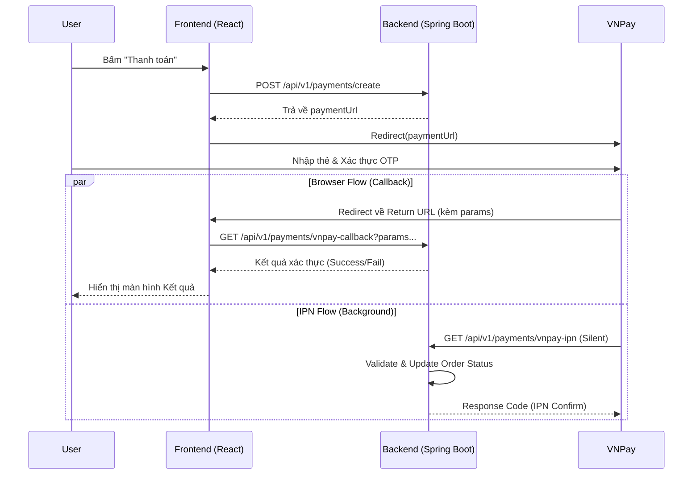

# Hướng dẫn Tích hợp Thanh toán VNPay (Full Flow)

Tài liệu hướng dẫn chi tiết quy trình tích hợp thanh toán VNPay cho Frontend, bao gồm cả luồng Callback (User Redirect) và IPN (Server Notification).

## 1. Tổng quan Luồng Thanh Toán

Quy trình thanh toán bao gồm hai luồng song song sau bước thanh toán:
1. **Browser Return Flow (Callback)**: User được chuyển hướng từ VNPay về lại Website. Dùng để hiển thị kết quả ngay lập tức cho User.
2. **Server-to-Server Flow (IPN)**: VNPay gọi ngầm đến Backend để báo trạng thái. Dùng để đảm bảo đơn hàng được cập nhật kể cả khi User tắt trình duyệt.



## 2. Chi tiết Triển khai Frontend

### Bước 1: Tạo yêu cầu thanh toán (Create Payment)
Khi người dùng chọn phương thức VNPay và bấm thanh toán.

*   **Endpoint**: `POST /api/v1/payments/create`
*   **Body**:
    ```json
    {
        "orderId": 125,
        "method": "VN_PAY" // hoặc "COD"
    }
    ```
*   **Xử lý FE**:
    Nhận `paymentUrl` từ response và chuyển hướng người dùng.
    ```javascript
    const handlePayment = async (orderId) => {
        const res = await api.post('/api/v1/payments/create', { 
            orderId, 
            method: 'VN_PAY' 
        });
        if (res.data.data.paymentUrl) {
            window.location.href = res.data.data.paymentUrl;
        }
    };
    ```

### Bước 2: Xử lý Kết quả trả về (Callback Flow)
VNPay sẽ redirect user về URL được cấu hình (ví dụ: `http://localhost:3000/payment-result`).

*   **Nhiệm vụ FE**: Lấy **toàn bộ** tham số trên URL gửi về Backend để xác thực (Checksum validation). **TUYỆT ĐỐI KHÔNG** tự kiểm tra `vnp_ResponseCode` ở FE để quyết định kết quả, vì user có thể sửa URL.
*   **Endpoint**: `GET /api/v1/payments/vnpay-callback`
*   **Parameter**: Gửi toàn bộ query params nhận được.
*   **Ví dụ Code**:
    ```javascript
    useEffect(() => {
        const verifyPayment = async () => {
            // 1. Lấy query string từ URL hiện tại
            const params = new URLSearchParams(window.location.search);
            const paramsObj = Object.fromEntries(params.entries());

            try {
                // 2. Gọi API xác thực
                const res = await api.get('/api/v1/payments/vnpay-callback', {
                    params: paramsObj
                });

                // 3. Xử lý hiển thị dựa trên response backend
                // Lưu ý: data trả về có thể khác tùy structure response của dự án
                const paymentData = res.data.data; 
                if (paymentData.status === 'SUCCESS') {
                    setResult('Thanh toán thành công!');
                } else {
                    setResult('Thanh toán thất bại hoặc lỗi xác thực!');
                }
            } catch (error) {
                console.error(error);
                setResult('Có lỗi xảy ra khi xác thực giao dịch.');
            }
        };

        if (window.location.search) {
             verifyPayment();
        }
    }, []);
    ```

## 3. Về Luồng IPN (Instant Payment Notification)
*FE Developer cần biết, nhưng không cần code phần này.*

*   **IPN là gì?**: Là cơ chế VNPay gọi trực tiếp vào Backend server của chúng ta để báo kết quả.
*   **Tác dụng**:
    *   Xử lý trường hợp User thanh toán xong nhưng mất mạng hoặc tắt tab trình duyệt ngay lập tức (không quay về trang Callback).
    *   Đảm bảo tính toàn vẹn dữ liệu của đơn hàng.
*   **Ảnh hưởng đến FE**:
    *   Trong `Order History` hoặc `Order Detail`, trạng thái đơn hàng có thể chuyển sang `PAID` từ phía Backend nhờ IPN xử lý, ngay cả khi User chưa quay lại trang kết quả.
    *   Backend đã mở endpoint `/api/v1/payments/vnpay-ipn` (Public access) để nhận request này.

## 4. Dữ liệu Test (Sandbox)
*   **Ngân hàng**: `NCB`
*   **Thẻ**: `9704198526191432198`
*   **Tên**: `NGUYEN VAN A`
*   **Ngày phát hành**: `07/15`
*   **OTP**: `123456`

## 5. Các Endpoint API Liên quan

| Action | Method | URL | Auth Required |
| :--- | :--- | :--- | :--- |
| Tạo thanh toán | `POST` | `/api/v1/payments/create` | **Yes** |
| Callback (FE gọi) | `GET` | `/api/v1/payments/vnpay-callback` | No |
| Xem đơn hàng | `GET` | `/api/v1/orders/{id}` | **Yes** |
