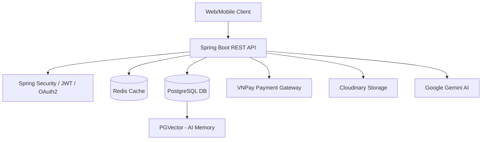

<h1 align="center">🏮 Tết Gift Commerce API 🏮</h1>

<p align="center">
  <b>Hệ thống Bán Quà Tết Trực Tuyến Tự Động & Thông Minh (RESTful API)</b>
</p>

<p align="center">
  
  
  
  
</p>

## 📌 Overview / Mô tả dự án

- **Bài toán giải quyết:** Cung cấp nền tảng thương mại điện tử chuyên biệt cho dịp Tết, giải quyết bài toán gói quà tặng tùy chỉnh (Custom Combo) và cá nhân hóa trải nghiệm qua hệ thống AI tự động tư vấn quà Tết dựa trên nhu cầu của khách hàng.
- **Đối tượng người dùng:** Khách hàng cá nhân, doanh nghiệp có nhu cầu mua sắm giỏ quà Tết, thiết kế hộp quà mang đậm dấu ấn cá nhân hoặc thương hiệu.
- **Tech highlights:**
  - Tích hợp **Spring AI** kết hợp Vector Database (**PGVector**) triển khai **RAG Chatbot** tư vấn 24/7.
  - Quản lý quá trình thanh toán nội địa qua cổng **VNPay** & Tự động xuất hóa đơn PDF (**Flying Saucer**).
  - Sử dụng **Redis** để tối ưu hóa hiệu suất load giỏ hàng, thông tin cấu hình và caching hệ thống.

## 🚀 Tech Stack

| Category         | Technologies                                                                 |
| ---------------- | ---------------------------------------------------------------------------- |
| **Core**         | Java 21, Spring Boot 3.x, Spring Security (OAuth2 Google, JWT)               |
| **Database**     | PostgreSQL, PGVector (Vector Database), Flyway (Migration)                   |
| **Caching/NoSQL**| Redis                                                                        |
| **AI / NLP**     | Spring AI, Google Gemini 3-4B-IT, ONNX Sentence Transformers (Embedding)     |
| **Cloud/3rd**    | Cloudinary (Image Storage), VNPay (Payment Gateway), JavaMailSender          |
| **DevOps**       | Docker (Multi-stage build), Docker Compose                                   |

## 🏗 Architecture Overview

Sơ đồ kiến trúc khái quát của hệ thống:


**Giải thích flow chính:**
- RESTful API thiết kế chuẩn mực, bảo mật qua JWT và hỗ trợ Oauth2 (Google Login).
- **RAG Chatbot Flow:** Người dùng đặt câu hỏi -> Text Embeddings (All-MiniLM-v2 qua ONNX Runtime) -> Vector Search trong bảng dữ liệu PGVector -> Trích xuất ngữ cảnh liên quan (nearest context) -> Đưa vào prompt cho Gemini tạo câu trả lời tự nhiên.
- **Order & Payment Flow:** Chọn sản phẩm & Custom Combo vào giỏ hàng (Cart được cache) -> Khởi tạo đơn (Order) -> Xử lý thanh toán VNPay (Sandbox) -> Call back xác nhận -> Tự động render file PDF Hóa Đơn và Gửi Email.

## ✨ Features

- **🔐 Xử lý Định danh & Bảo mật (Auth):**
  - Đăng ký, đăng nhập tài khoản.
  - Hỗ trợ đăng nhập qua Google OAuth2.
  - Phân quyền theo cấp độ (Role: Admin / User / Lawyer).
- **🛍 Sản phẩm & Quà tặng (Products & Bundles):**
  - Quản lý danh mục, sản phẩm, hình ảnh lưu trữ trực tiếp trên Cloudinary.
  - Tính năng **Custom Combo**: Cho phép khách hàng tự thiết kế giỏ quà từ các thành phần lẻ.
- **🛒 Quản lý Đơn hàng (Cart & Order):**
  - Quản lý giỏ hàng linh hoạt (Cart & Cart Items).
  - Áp dụng mã giảm giá (Discount) theo % hoặc Fix Amount.
  - Xử lý trạng thái giao hàng, trạng thái thanh toán.
- **💳 Thanh toán & Xuất hóa đơn (Payment & Invoice):**
  - Thanh toán một lần an toàn thông qua cổng VNPay.
  - Tự động xuất biên lai, hóa đơn chứng từ ở định dạng PDF đính kèm qua Email.
- **🤖 Trợ lý ảo AI Tết (RAG Chatbot):**
  - Bot tư vấn quà Tết cá nhân hoá theo cấu hình ngân sách, đối tượng nhận quà.
  - Lưu và phân tích ngữ cảnh chat session của User.
- **📊 Admin Dashboard Statistics:**
  - APIs thiết kế chuyên biệt phục vụ giám sát doanh thu, tổng số đơn hàng, Top khách hàng chi tiêu nhiều nhất.
- **📝 Quản lý Nội dung (Blog & Review):**
  - Chức năng quản trị Blog / Bài viết.
  - Cho phép người dùng đánh giá (Review) trải nghiệm mua sắm.

## 📂 Project Structure

```text
src/main/java/com/tetgift
├── component/      # Các cấu hình interceptor, utilities bean (Ví dụ: config VNPay, JWT bean)
├── configuration/  # Cài đặt Spring Security, Redis, Spring AI, WebMVC...
├── controller/     # REST APIs Controller theo Domain 
├── dto/            # Data Transfer Objects (Request/Response)
├── enums/          # Định nghĩa Enum (OrderStatus, PaymentStatus...)
├── exception/      # Global Exception Handler (Tối ưu hóa Response Error)
├── mapper/         # MapStruct interfaces tự động chuyển đổi DTO <-> Entity
├── model/          # Định nghĩa Database JPA Entities & Redis Hash Models 
├── repository/     # Spring Data JPA Repositories
├── security/       # Config bảo mật, Custom UserDetails, JWT Filter
├── service/        # Business Logic / Tính toán logic cốt lõi
└── util/           # Chứa các helper, tiện ích dùng chung
```

## 🛠 Getting Started

### Prerequisites
- Docker & Docker Compose
- Java 21+
- PostgreSQL 16+ (Hỗ trợ extension `pgvector`)
- Redis Cache server

### Cài đặt và Chạy ứng dụng

1. **Clone repository:**
   ```bash
   git clone <repository_url>
   cd tet-gift-commerce-api
   ```
2. **Environment Config:**
   - Copy file mẫu và cung cấp thông số môi trường của bạn:
     ```bash
     cp .env .env
     ```
   - Cần điền các thông tin quan trọng hệ thống như: `POSTGRES_USER`, `POSTGRES_PASSWORD`, `REDIS_HOST`, `GOOGLE_CLIENT_ID`, `GEMINI_API_KEY`, `VNPAY_TMN_CODE`, `CLOUDINARY_API_KEY`...
3. **Run with Docker Compose:**
   ```bash
   docker-compose up -d
   ```
4. **Run Spring Boot Locally:**
   ```bash
   mvn spring-boot:run
   ```
5. **API Base URL:**
   - Local App: `http://localhost:8080/api/v1`
   - Production / Frontend URL: `https://store.quanghuycoder.id.vn` 

## 📚 API Documentation

- **Swagger UI:** `http://localhost:8080/swagger-ui/index.html` hoặc `http://localhost:8080/v3/api-docs` (Swagger v3 tích hợp sẵn).
- Truy cập vào tài liệu mô tả chi tiết chuẩn Request/Response đính kèm bên trong nội bộ Backend E-commerce.

| Feature         | Method | Path                           | Auth      |
| --------------- | ------ | ------------------------------ | --------- |
| **Login**       | POST   | `/api/v1/auth/login`           | Public    |
| **Google**      | GET    | `/api/v1/auth/google/url`      | Public    |
| **Cart Info**   | GET    | `/api/v1/cart/my-cart`         | Bearer    |
| **Payment**     | GET    | `/api/v1/payment/vnpay`        | Bearer    |
| **Chat AI**     | POST   | `/api/v1/chatbot/chat`         | Bearer    |

## 🧠 Key Technical Decisions

1. **Tại sao dùng PGVector cho RAG AI thay vì Milvus/Pinecone?**
   - **Trade-off:** Giảm thiểu sự phức tạp của cơ sở hạ tầng. Do volume dữ liệu sản phẩm và bài viết cho một dự án E-Commerce tầm trung thường không lên tới hàng trăm triệu document, việc tích hợp PGVector ngay trên PostgreSQL giúp tiết kiệm chi phí Cloud, deploy gọn nhẹ (Single DB). PGVector Index HNSW vẫn hoàn toàn đảm bảo tốc độ cực tốt (ms) cho truy xuất RAG của Chatbot AI và tương thích hoàn toàn với hệ sinh thái Spring Data JPA.
2. **Kiến trúc Monolithic & Tối ưu hóa Database:**
   - **Lý do lựa chọn:** Phù hợp với Scale hiện tại, Monolithic chia Domain Package giúp giữ mức Overhead gọi API nội bộ thấp. Để giảm thiểu load cho DB trong lúc query nặng (Như Cart, Combo Options), hệ thống ưu tiên tích hợp Redis.
3. **Tại sao sử dụng MapStruct & ONNX Runtime trên Docker?**
   - **Chống Bottleneck:** MapStruct generate bytecode trong lúc Build thay vì dùng Reflection như ModelMapper (tối đa hóa tốc độ mapping ở Runtime).
   - **Sự ổn định của AI:** Image Docker Build được add sẵn ONNX Sentence Transformers để tránh bị timeout tải model nhúng khi ứng dụng scale out.

## 🧪 Testing

- **Strategy:** Thực hiện Integration / Service logic Testing trên những hàm xử lý Discount và tạo Bundle. 
- 
- Lệnh chạy test:
  ```bash
  mvn test
  ```

## ☁️ Deployment

- **Containerization:** Toàn bộ Backend được đóng gói chạy trên `eclipse-temurin:21-jre-jammy` nhằm đảm bảo support hoàn thiện thư viện GLIBC >= 2.27 cho Spring AI OnnxRuntime.
- **CI/CD Pipeline:** Triển khai thông qua Docker Compose & Scripts Automation Deployment.
- **Live Demo Link:** [Store Web App](https://store.quanghuycoder.id.vn)
- **Live API:** [API Endpoint](https://api.quanghuycoder.id.vn)

## 🗺 Roadmap & Contact

- [x] Thiết kế Database, cấu hình PostgreSQL & Redis, JWT.
- [x] Quản lý Module Người Dùng và Giỏ quà Tết.
- [x] Tích hợp Cổng thanh toán VNPay và Hóa đơn.
- [x] Hoàn thiện trải nghiệm AI ChatBot (Vector Store).
- [x] Dashboard Thống Kê Nâng Cao.
- [ ] Push Notifications tự động.
- [ ] Tích hợp Elasticsearch cho tìm kiếm Text mở rộng.

---
**Contact:**
- **Developer:** Quang Huy Coder
- **Email:** qhuyddbmt123@gmail.com
- **LinkedIn:** N/A
